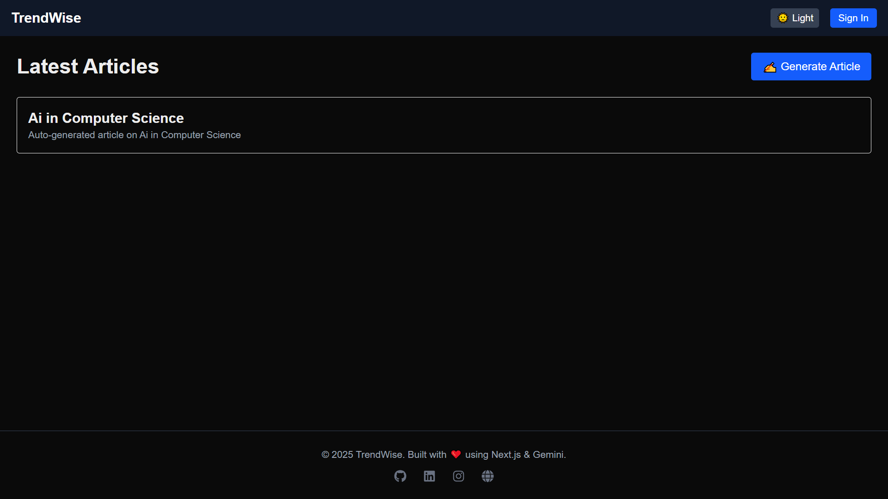
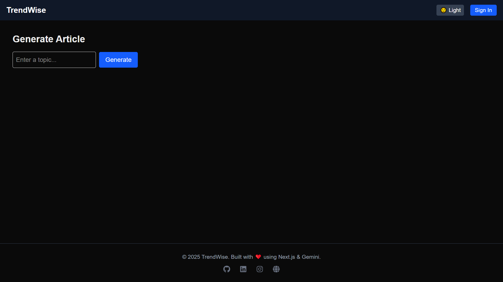
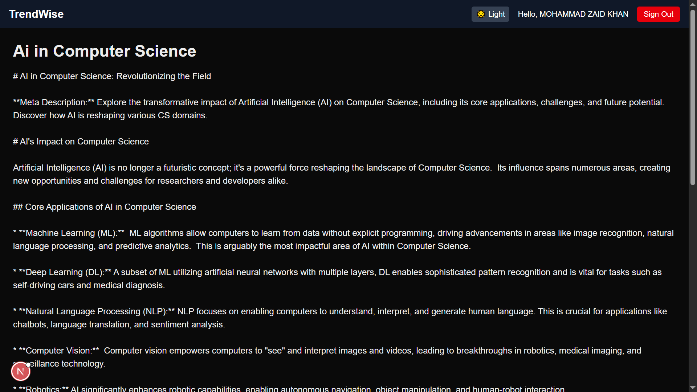
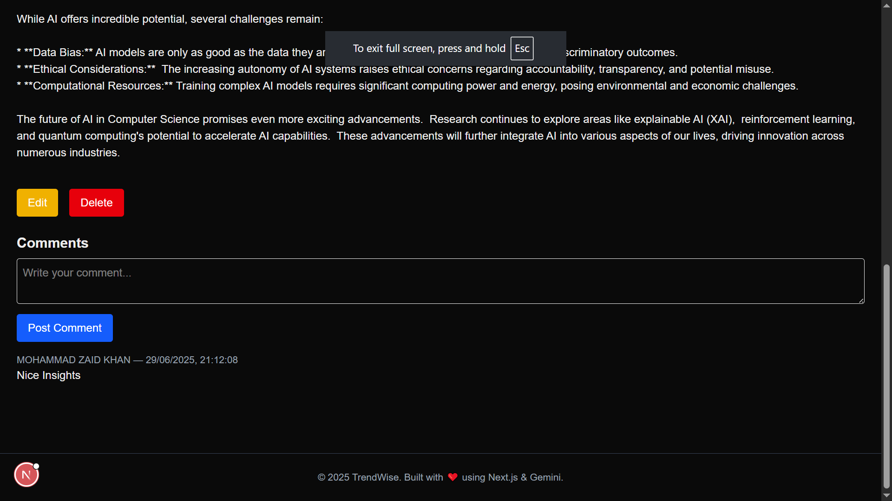

# 🧠 TrendWise — AI-Powered Blog Generator

TrendWise is an AI-driven blogging platform built with **Next.js 15 (App Router)**, **Tailwind CSS**, **Google Gemini API**, and **MongoDB**. Authenticated users can generate SEO-optimized blog posts, leave comments, and browse AI-generated content — all in a beautiful dark-themed UI.


---

## ✨ Features

* ✍️ **AI-Powered Blog Generation** via Google Gemini Pro
* 🔐 **Google Authentication** with NextAuth.js
* 💾 **SEO-Optimized Metadata**, Sitemap, robots.txt
* 🌗 **Dark Mode Toggle** (with next-themes + Tailwind)
* 💬 **Comments System** (MongoDB)
* 🖼️ Responsive UI with Tailwind CSS
* 📁 Dynamic Routing using Next.js App Router
* 🌍 **Deployed on Vercel** with full CI/CD

---

## 🧰 Tech Stack

| Tech          | Icon                                                                                            |
| ------------- | ----------------------------------------------------------------------------------------------- |
| Next.js       |               |
| Tailwind CSS  |  |
| NextAuth.js   |    |
| Google Gemini |              |
| MongoDB       |            |
| Vercel        |               |
| React Icons   |    |

---

## 🔧 Setup Instructions

1. **Clone the repo**

   ```bash
   git clone https://github.com/yourusername/trendwise.git
   cd trendwise
   ```

2. **Install dependencies**

   ```bash
   npm install
   ```

3. **Create `.env.local` file**

   ```env
   NEXTAUTH_URL=http://localhost:3000
   NEXTAUTH_SECRET=your-generated-secret
   GOOGLE_CLIENT_ID=your-client-id
   GOOGLE_CLIENT_SECRET=your-client-secret
   MONGODB_URI=mongodb+srv://<user>:<pass>@cluster.mongodb.net/trendwise
   GEMINI_API_KEY=your-gemini-api-key
   ```

4. **Run locally**

   ```bash
   npm run dev
   ```

---

## 🌐 Live Demo / Deployed on vercel

👉 [https://trend-wise.vercel.app](https://trend-wise-seven.vercel.app)

---

## 📸 Screenshots

> *You can embed screenshots or screen recordings here*

* **Home Page**

  

* **Generate Article**

  

* **Article Detail + Comments**

  
  

---

## 🙌 Author

**Mohammad Zaid Khan**
👨‍💻 [GitHub](https://github.com/64bitAtomic) · 🌐 [Portfolio](https://innospark.netlify.app) · 🐦 [Twitter](https://twitter.com/)


---

## ⭐️ Product Name- TrendWise

<iframe src="./Product Name- TrendWise.pdf" width="100%" height="600px"></iframe>

